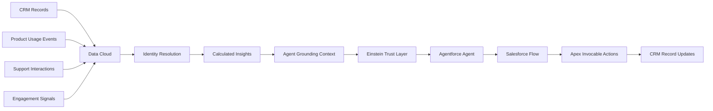
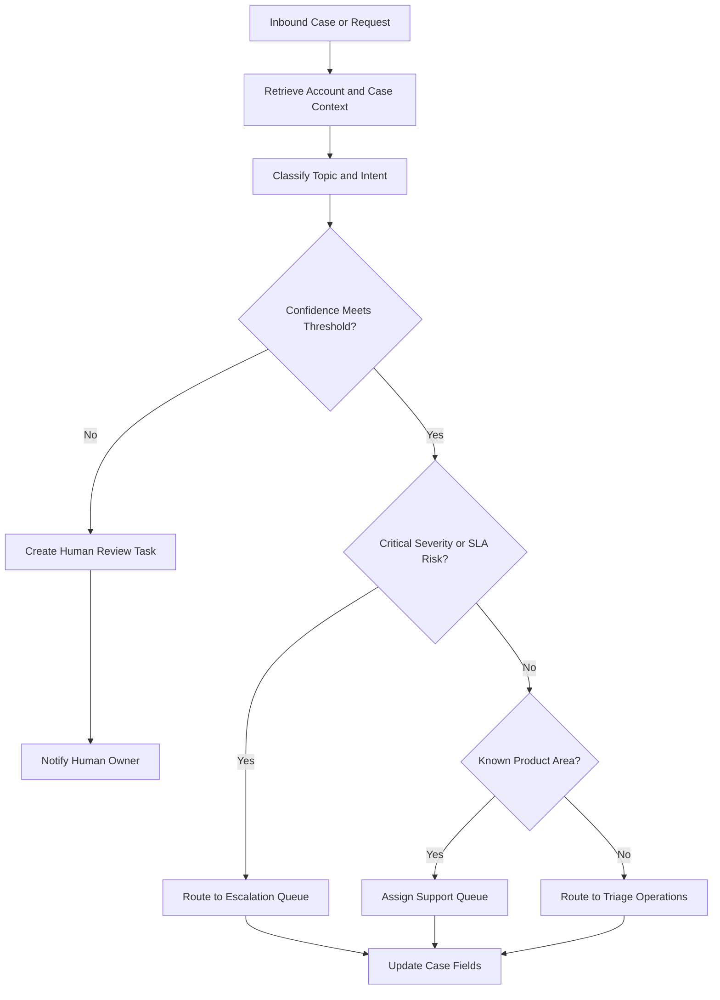
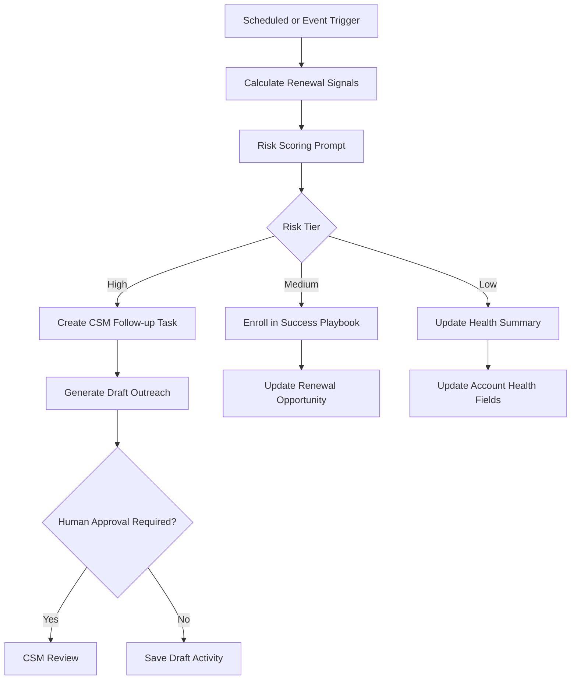
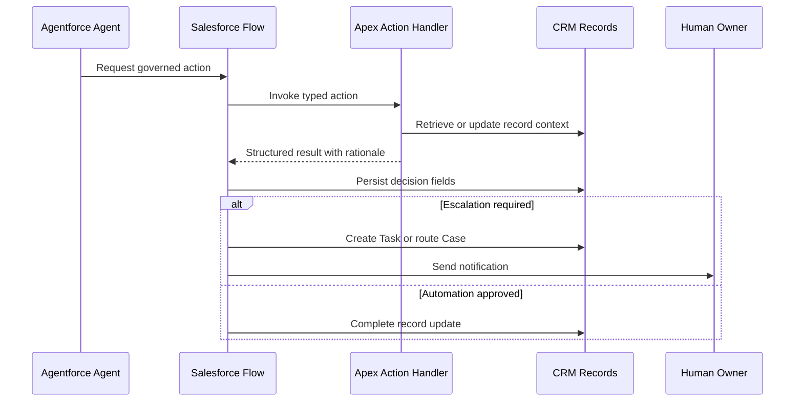

# Agent Topology Diagrams

## ASCII Overview

```text
                 +----------------------+
                 |      Data Cloud      |
                 | identity + insights  |
                 +----------+-----------+
                            |
                            v
 +-----------+      +----------------+      +------------------+
 | CRM Data  +----->| Agent Grounding+----->| Agentforce Agent |
 | Account   |      | Prompt Builder |      | Topic + Action   |
 | Case      |      +-------+--------+      +--------+---------+
 | Contract  |              |                        |
 +-----------+              |                        v
                            |              +------------------+
                            |              | Flow Orchestration|
                            |              +--------+---------+
                            |                        |
                            v                        v
                  +------------------+      +------------------+
                  | Trust Layer      |      | Apex Actions     |
                  | masking + audit  |      | retrieval/update |
                  +------------------+      +--------+---------+
                                                   |
                               +-------------------+-------------------+
                               v                                       v
                         CRM record update                     Human escalation
                         Case/Task/Opp                         Queue/Task/Alert
```

## Data Cloud to Agent Grounding



## Triage Agent Decision Tree



## Renewal Agent Workflow



## Human Escalation and CRM Updates


