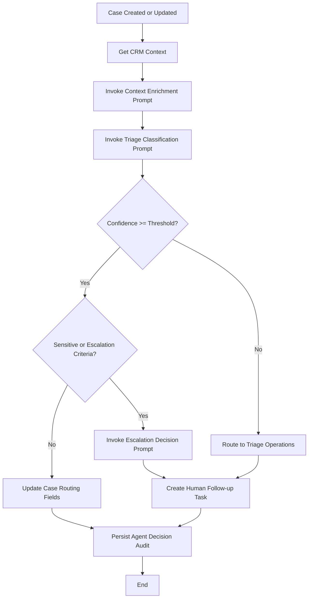
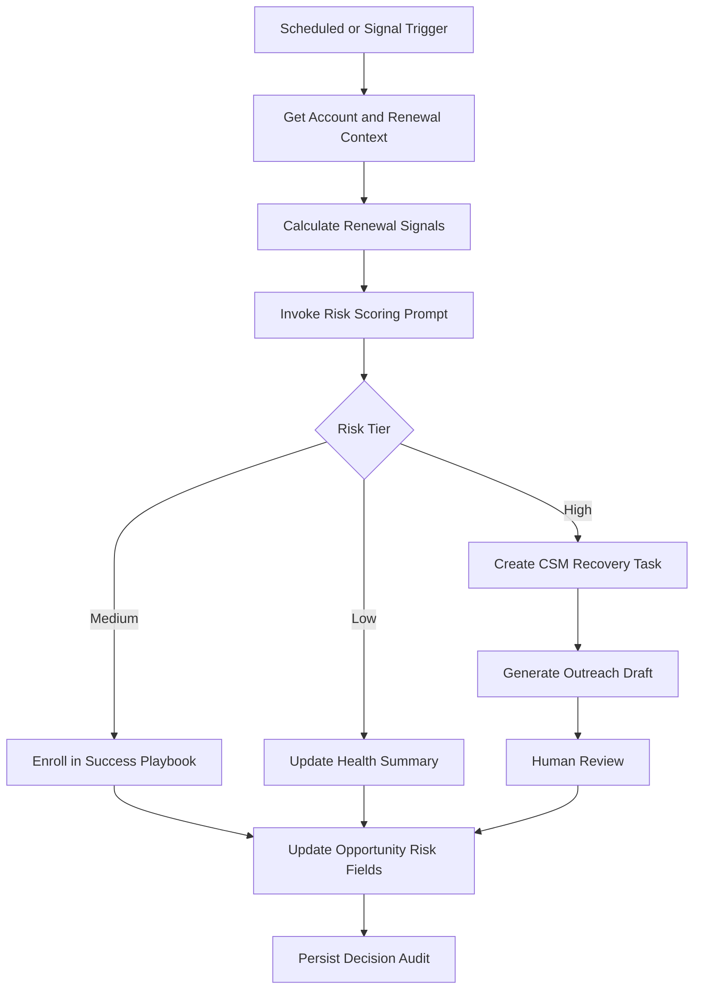
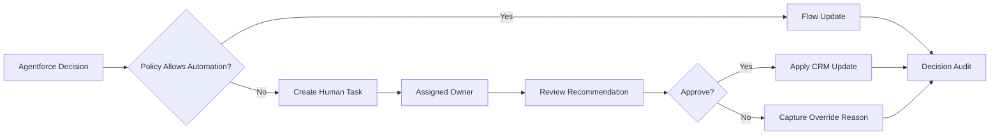

# Flow Diagrams

## Triage Agent Workflow

```mermaid
flowchart TD
    A[Case Created or Updated] --> B[Get CRM Context]
    B --> C[Invoke Context Enrichment Prompt]
    C --> D[Invoke Triage Classification Prompt]
    D --> E{Confidence >= Threshold?}
    E -- No --> F[Route to Triage Operations]
    E -- Yes --> G{Sensitive or Escalation Criteria?}
    G -- Yes --> H[Invoke Escalation Decision Prompt]
    G -- No --> I[Update Case Routing Fields]
    H --> J[Create Human Follow-up Task]
    F --> J
    I --> K[Persist Agent Decision Audit]
    J --> K
    K --> L[End]
```

## Renewal Agent Workflow

```mermaid
flowchart TD
    A[Scheduled or Signal Trigger] --> B[Get Account and Renewal Context]
    B --> C[Calculate Renewal Signals]
    C --> D[Invoke Risk Scoring Prompt]
    D --> E{Risk Tier}
    E -- High --> F[Create CSM Recovery Task]
    E -- Medium --> G[Enroll in Success Playbook]
    E -- Low --> H[Update Health Summary]
    F --> I[Generate Outreach Draft]
    I --> J[Human Review]
    G --> K[Update Opportunity Risk Fields]
    H --> K
    J --> K
    K --> L[Persist Decision Audit]
```

## Agent-to-Human Handoff

```mermaid
flowchart LR
    Agent[Agentforce Decision] --> Policy{Policy Allows Automation?}
    Policy -- Yes --> Flow[Flow Update]
    Policy -- No --> Task[Create Human Task]
    Task --> Owner[Assigned Owner]
    Owner --> Review[Review Recommendation]
    Review --> Approve{Approve?}
    Approve -- Yes --> Apply[Apply CRM Update]
    Approve -- No --> Override[Capture Override Reason]
    Flow --> Audit[Decision Audit]
    Apply --> Audit
    Override --> Audit
```
